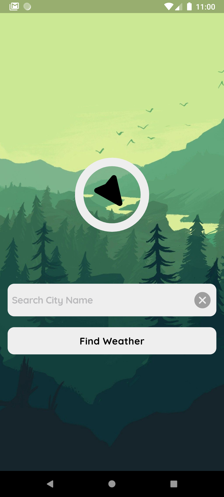
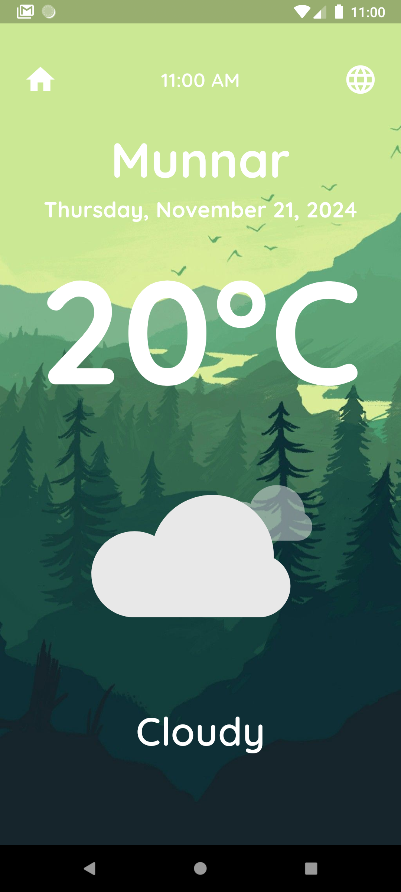

# Weather App 🌤️

A Flutter application that fetches and displays weather data for any city using the OpenWeather API. 

---
## App Screenshot

<div style="display: flex; flex-wrap: wrap; gap: 20px;">
  
  
</div>


## 🚀 Features
- View current weather conditions.
- Displays temperature, current date, time, and cityname.
- Animated weather conditions using **Lottie**.
- Supports multiple locales for a personalized experience.

---

## 🛠️ Tech Stack
- **Flutter**: Frontend framework for building cross-platform apps.
- **OpenWeather API**: Provides weather data.
- **Lottie**: For animated weather visualizations.

---

## 📝 Prerequisites
Before you begin, ensure you have the following installed:
- [Flutter SDK](https://flutter.dev/docs/get-started/install) (latest stable version)
- [Android Studio](https://developer.android.com/studio) or [Visual Studio Code](https://code.visualstudio.com/) with Flutter and Dart plugins.
- [Git](https://git-scm.com/)

---

## ⚙️ Setup Instructions

### Clone the Repository
```bash
git clone <repository_url>
cd <repository_name>
```

### Install Dependencies
```bash
flutter pub get
```

### API Key Configuration
1. Sign up at [OpenWeather](https://openweathermap.org/) to get your API key.
2. Open the file `lib/utils/constants.dart`.
3. Add your API key:
   ```dart
   const String apiKey = 'YOUR_API_KEY';
   ```

### Run the Application
To launch the application on an emulator or physical device:
```bash
flutter run
```

---

## 🧪 Running Tests
To execute the widget and unit tests:
```bash
flutter test
```

---

## 🌐 Accessing the Deployed Version
The app is not deployed as a web application but can be installed on devices using the following:
1. **Android**: [Download APK](#) (Provide a link to your APK file, if available)
2. **iOS**: Add instructions to get the TestFlight invite link, if applicable.

---

## 💡 Contributing
1. Fork the repository.
2. Create your feature branch:
   ```bash
   git checkout -b feature/your-feature-name
   ```
3. Commit your changes:
   ```bash
   git commit -m 'Add some feature'
   ```
4. Push to the branch:
   ```bash
   git push origin feature/your-feature-name
   ```
5. Open a pull request.

---

## 📜 License
This project is licensed under the MIT License. See the `LICENSE` file for more information.

---

## 📧 Contact
If you have any questions or feedback, feel free to reach out:
- **Email**: azhardev96@gmail.com

---

Replace placeholders like `<repository_url>` and `YOUR_API_KEY` with your project-specific details. Ensure all instructions align with how your app is set up.